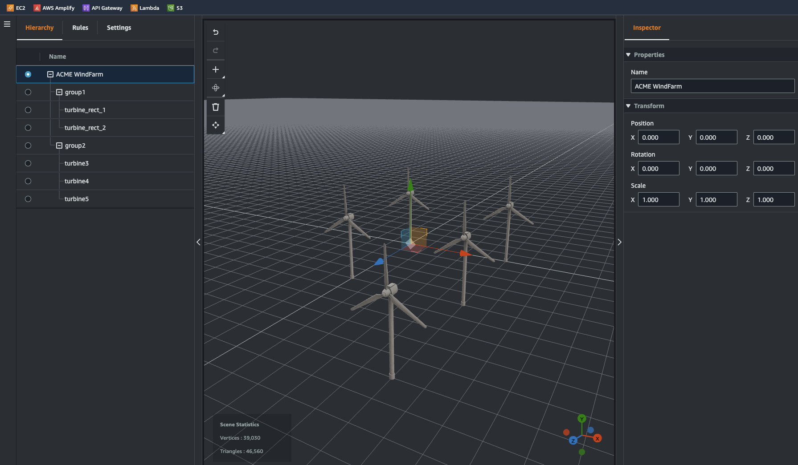

# Twinmaker Builder with CDK

This sample project shows a pattern on how to dynamically create entities in Twinmaker
and generate the corresponding 3D scene by using CDK automation.

## Index

 - [Introduction](#introduction)
 - [Domain Model](#domain-model)
 - [Usage](#usage)
 - [Start From Scratch](#start-from-scratch)
 - [Repository content](#repository-content)
  - [Domain model reader](#a-domain-model-reader)
  - [Two Visitor Base Classes](#two-visitor-base-classes)
  - [Random Component Type](#a-random-component-type)
  - [Tests](#tests)
 - [Commit hooks](#commit-hooks)
 - [Contributing](#contributing)
 - [License](#license)


## License

This code is distributed under the
[Apache License, Version 2.0](http://www.apache.org/licenses/LICENSE-2.0),
see LICENSE.txt and NOTICE.txt for more information.

## Introduction

When using TwinMaker and generating digital twins of real objects, it can quickly become
overwhelming defining all the automation to generate a complex scene. Most of the time, you 
can find repeated objects in the scene that share the same properties or repeatable patterns. 
For instance, in a warehouse, you can find multiple `gates` on a `dock`. They share the same type and often the
same appearance. There is no real need to define all of them each time.

Simplifying the definition of a digital twin will allow scaling vertically (building bigger twins) and
horizontally (building lots of twins).

The idea is to simplify the definition of the digital twin and use some business vocabulary 
(called domain model) to describe it. Our code will then visit that model and transform it
in two different ways :

 - the hierarchy of TwinMaker entities
 - the 3D scene for TwinMaker

In this sample, we will build a wind farm composed of wind turbines that are place following
shapes on a field : 



## Domain Model

The Domain Model is your model, and you can define whatever you want in it : has nothing to do with AWS or AWS IoT Twinmaker. 
In this sample, we will have several objects:

 - `WindFarm` : It is the root object and we can define some parametter like a name for instance
 - `TurbineGroup` : It is a group of wind turbines that defines how wind turbine are spread. It also defines a position.
 - `Turbine` : It defines a turbine and its properties, especially a identifier that allows us to identify the data to fetch

We are then able to define our WindFarm with a YAML file like this:

```yaml
name: ACME WindFarm
items:
- name: group1
  type: TurbineGroup  
  items:
  - name: turbine_rect_1
    type: Turbine
    device_code: "0x01"
  - name: turbine_rect_2
    type: Turbine
    device_code: "0x02"
- name: group2
  type: TurbineGroup
  model:    
    position: {x: 10, y: 0, z: 0}
  items:
  - name: turbine3
    type: Turbine
    device_code: "0x03"
  - name: turbine4
    type: Turbine
    device_code: "0x04"
  - name: turbine5
    type: Turbine
    device_code: "0x05"
  

  ...
```

This definition file doesn't mention any AWS construction and anybody who can read YAML will be able to understand and make changes to it.

## Usage

You are responsible for the cost of the AWS services used while running this sample deployment. There is no additional cost for using this sample. For full details, see the pricing pages for each AWS service you will be using in this sample. Prices are subject to change.

This is a regular CDK repository, so running the following recipe :

```bash
$ python3 -m venv .venv
$ . ./.venv/bin/activate
$ pip install -r requirements.txt
$ cdk deploy
```

will deploy the complete TwinMaker project.

> :information_source: This sample deploys a S3 bucket for which logging is enabled by default. As TwinMaker uses the S3 bucket, its usage will be logged in the logging bucket. As [mentionned in the documentation](https://docs.aws.amazon.com/AmazonS3/latest/userguide/enable-server-access-logging.html), there is no extra-charge for enabling logging on a S3 bucket, however any log files that the system delivers to you will accrue the usual charges for storage. To disable logging on the S3 bucket, you can set the `s3_logging` variable to `False` in [wind_farm_stack.py](./wind_farm/wind_farm_stack.py#L25).

## Start from scratch

This repository is a sample deploying a farm of windturbines. If you want to reuse this repository, a [start from scratch documentation](doc/start_from_scratch.md) can help you building you own model and visitors.

## Repository content

### A Domain Model Reader

The `twinmaker_builder` module contains objects that allow to read the YAML file and dynamically link it to existing class implementation. For instance, the following code allows to load the domain model:

```python
farm = TwinMakerRoot.load_from_yaml("wind_farm/farm.yaml", WindFarm)
```

### Two Visitor Base Classes

Once the domain model is loaded, we can visit its entities. Two base abstract classes are provided:

 - `TwinMakerCDKVisitor` : visits the model to generate some calls to CDK. 
 - `SceneVisitor` : visits the model to generate a Twinmaker 3D scene in JSON. 

Concrete classes implementing those class have to implement hooks methods like `on_turbine` that are dynamically introspected and called by the visiting mechanism. More on how to create your own model and visiting mechanism can be found in the [start from scratch documentation](doc/start_from_scratch.md)


### A Random Component Type

The `random_component` module contains the implementation of a TwinMaker component type that return random values. It is helpful to stub datasources.


### Tests

Unit tests are provided to verify everything is still working. It is a great source to understand how everything works. You can run the whole test suite with PyTest: 

```bash
$ pytest --cov=. tests
............                                                                                                                                                                        [100%]

---------- coverage: platform darwin, python 3.10.0-final-0 ----------
Name                                                                  Stmts   Miss  Cover
-----------------------------------------------------------------------------------------
app.py                                                                    8      8     0%
tests/__init__.py                                                         0      0   100%
tests/unit/__init__.py                                                    0      0   100%
tests/unit/dummy_stack.py                                                13      0   100%
tests/unit/test_cdk_visitor.py                                           18      0   100%
tests/unit/test_domain.py                                                26      0   100%
tests/unit/test_random_lambda.py                                         19      0   100%
tests/unit/test_scene_visitor.py                                         65      0   100%
tests/unit/test_twinmaker_cdk_automation_stack.py                        11      0   100%
twinmaker_builder/__init__.py                                           127      6    95%
twinmaker_builder/scene.py                                               50      4    92%
wind_farm/__init__.py                                                     0      0   100%
wind_farm/random_component/__init__.py                                   19      0   100%
wind_farm/random_component/lambda_code/handler.py                        43      0   100%
wind_farm/random_component/udq_helper_utils/udq_utils/__init__.py         0      0   100%
wind_farm/random_component/udq_helper_utils/udq_utils/udq.py             38      8    79%
wind_farm/random_component/udq_helper_utils/udq_utils/udq_models.py     175     42    76%
wind_farm/visitors.py                                                    21      0   100%
wind_farm/wind_farm.py                                                   10      0   100%
wind_farm/wind_farm_stack.py                                             35      0   100%
-----------------------------------------------------------------------------------------
TOTAL                                                                   678     68    90%

12 passed in 19.13s
```

## Commit hooks

This repo is configured for using `pre-commit` hooks. To install them run the following:

```bash
$ cd twinmaker-cdk-automation
twinmaker-cdk-automation$ pre-commit install --hook-type pre-commit
```

Two hooks are configured:

 - [Black](https://github.com/psf/black): formats code
 - [flake8](https://flake8.pycqa.org/en/latest/): does some code checking

When you commit, those tools run their check and prevent you from committing if they fail. This was configured following that blog post: [Precommits using black and flake8](https://ljvmiranda921.github.io/notebook/2018/06/21/precommits-using-black-and-flake8/)


## Contributing
We welcome community contributions and pull requests. See [CONTRIBUTING.md](CONTRIBUTING.md) for information on how to set up a development environment and submit code.

## License

This code is distributed under the
[Apache License, Version 2.0](http://www.apache.org/licenses/LICENSE-2.0),
see LICENSE.txt and NOTICE.txt for more information.